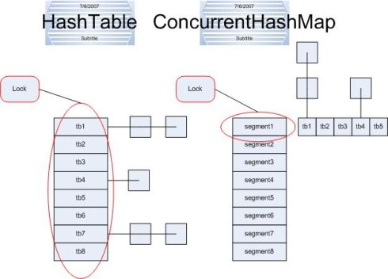

# cmap
ConcurrentMap (cmap) 是 **go** 分片加锁 map 的一种。它在通过减小锁的粒度和持有的时间来提高并发性。

## 原理

ConcurrentMap 和 MutexMap 主要区别就是围绕着锁的粒度以及如何锁。如图

左边便是MutexMap的实现方式---锁整个hash表；而右边则是ConcurrentMap的实现方式---锁桶（或段）。ConcurrentMap将hash表分为8个桶（默认值），诸如load,store,delete等常用操作只锁当前需要用到的桶。

 ConcurrentMap中主要实体类就是三个：ConcurrentMap（整个Hash表）,Node（节点），Bucket（桶），对应上面的图可以看出之间的关系。

## grow 和 shrink

### 扩容gorw

增加key后，hash表总key数量count满足条件：count > 1<<2*B，或在buckut储存的key数量size满足条件：size > 1<<(B+1)，就会对hash表进行扩容。

### 收缩shrink

删除key后，hash表总key数量count满足条件：count > initSize && count < 1<<(B-1)，hash表进行收缩。

**扩容收缩操作：**

1. 将 resize 置为1。
2. newLen = 1<<B，申请新 node 。
3. 将旧node疏散到新node。
4. 完成疏散后，将旧node置空，resize置0。

